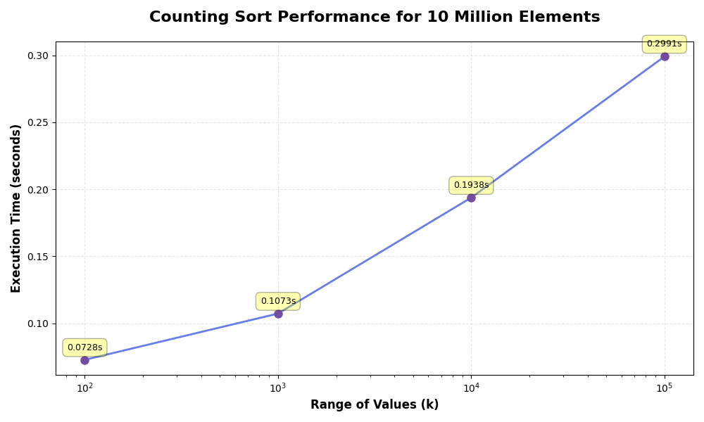

Readme · MD
Copy

# Counting Sort for 10 Million Integers

This repository contains a Java implementation of the Counting Sort algorithm for sorting a dataset of 10 million integers. The project includes dataset generation, benchmarking, and analysis of the algorithm's performance.

## Table of Contents

* [Overview](#overview)
* [Algorithm](#algorithm)
* [Project Structure](#project-structure)
* [Setup and Usage](#setup-and-usage)
* [Benchmark Results](#benchmark-results)
* [Graphs](#graphs)

## Overview

Sorting is a fundamental operation in computer science. While many sorting algorithms rely on comparisons, Counting Sort is a non-comparison-based algorithm that can achieve O(n + k) time complexity, where:

* n = number of elements
* k = range of input values

This project demonstrates Counting Sort's efficiency for very large datasets and analyzes how value range (k) affects performance.

## Algorithm

Counting Sort works in these main steps:

1. Find the maximum value in the array.
2. Create a count array to store frequencies of each value.
3. Compute cumulative counts.
4. Build the sorted output array using cumulative counts.

It is stable, linear-time for suitable input ranges, and memory usage depends on n + k.

## Project Structure

```
counting-sort-10m/
│
├── src/
│   ├── CountingSort.java       # Core sorting algorithm
│   ├── DataGenerator.java      # Generates random dataset of 10 million integers
│   └── Benchmark.java          # Measures runtime and verifies correctness
│
├── data/
│   └── dataset_10m.txt         # Generated dataset
│
├── results/
│   └── benchmark_results.txt   # Recorded execution times for experiments
│
├── docs/
│   ├── performance_graph.png   # Graph of sorting time vs value range
│   └── report.pdf              # Detailed project report
│
└── README.md
```

## Setup and Usage

1. Clone the repository:

```bash
git clone 
cd counting-sort-10m
```

2. Compile the Java programs:

```bash
javac src/*.java
```

3. Generate dataset (optional if you want to regenerate):

```bash
java -cp src DataGenerator
```

4. Run the benchmark:

```bash
java -cp src Benchmark
```

Output will include:
* Execution time
* Verification that the array is sorted correctly

## Benchmark Results

| Experiment | n          | k       | Time (seconds) |
|------------|------------|---------|----------------|
| 1          | 10,000,000 | 100     | 0.0728         |
| 2          | 10,000,000 | 1,000   | 0.1073         |
| 3          | 10,000,000 | 10,000  | 0.1938         |
| 4          | 10,000,000 | 100,000 | 0.2991         |

**Observation:** As the value range increases, execution time increases gradually, confirming the theoretical complexity of O(n + k).

## Graphs



The graph illustrates the impact of the value range (k) on the runtime of Counting Sort. Runtime increases slightly as k grows while the number of elements remains constant.